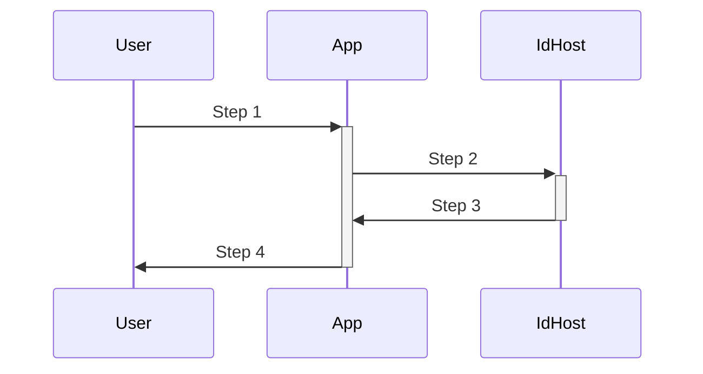

# The DID Web Authorization Framework

## TODO

            Update this spec to rename things given new understanding of how did documents
            are used to resolve service endpoints.


            ```
            redo the  `Auth Resolution Methods` part of this spec
            ### Auth Resolution Methods
            #### magic-link
            #### secret-code
            #### http-redirect
            #### callback
            ```


## Abstract

The DID Web Authorization Framework expands upon the [did:web spec][did-web-spec]
enabling cross-domain authentication and the ability to grant and revokable
access to protected HTTP resources to other identities.

[[table of contents here]]


## Introduction

As of 2023 authentication on the web is dominated by OAuth2. One-click-login
buttons are limited to a small set of mega corporations. This is not open
enough. A truly open authentication framework would allow you to host your
identifiers and credentials anywhere you like. And ideally move them at will.

What's wrong with OAuth 2.0? In short [OAuth 2.0][oauth-2-spec]
was never designed to be a decentralized authentication framework. Oauth 2.0
was designed to enable a third-party application to obtain limited access to
an HTTP service on behalf of a user. It later reached massive adoption when
it was used to simplify the signup and login process with one-click-login.

The major limitation with using OAuth2 as a basis for decentralized
authentication is [The NASCAR Problem](https://indieweb.org/NASCAR_problem).
There is only so much room for "sign in with X" brands.

The DID Web Authorization Framework addresses these limitations by introducing
decentralized cooperative protocols that allow any domain to both host and
consume cross-domain identifiers and credentials.

Instead of authenticating in with an email and password, or with a major
centralized brand, users can authenticate using any valid identifier hosted
at any domain.

This specification is designed for use with HTTP ([RFC2616][http-spec]). The
use of The DID Web Authorization Framework over any protocol other than HTTP
is out of scope.

### Specs

This SPEC builds upon and inherits the terminology from the following spec:

- HTTP - https://www.rfc-editor.org/rfc/rfc2616
- SMPT - https://www.rfc-editor.org/rfc/rfc2821
- DID - https://www.w3.org/TR/did-core/
- DID Web - https://w3c-ccg.github.io/did-method-web/
- JWT - https://www.rfc-editor.org/rfc/rfc7519
- Verifiable Credentials Data Model v1.1 -
  https://www.w3.org/TR/vc-data-model/
- Well Known DID Configuration -
  https://identity.foundation/.well-known/resources/did-configuration/


### Notational Conventions

   The key words "MUST", "MUST NOT", "REQUIRED", "SHALL", "SHALL NOT",
   "SHOULD", "SHOULD NOT", "RECOMMENDED", "MAY", and "OPTIONAL" in this
   specification are to be interpreted as described in [RFC2119].

   This specification uses the Augmented Backus-Naur Form (ABNF)
   notation of [RFC5234].  Additionally, the rule URI-reference is
   included from "Uniform Resource Identifier (URI): Generic Syntax"
   [RFC3986].

   Certain security-related terms are to be understood in the sense
   defined in [RFC4949].  These terms include, but are not limited to,
   "attack", "authentication", "authorization", "certificate",
   "confidentiality", "credential", "encryption", "identity", "sign",
   "signature", "trust", "validate", and "verify".

   Unless otherwise noted, all the protocol parameter names and values
   are case sensitive.


### Terms

#### User

The human interacting with a device.

#### Hosted Identifier

A [DID][did-spec] hosted at a single http domain, using the [did:web method]
[did-web-spec], representing an individual human, organization or app. It
can be granted revocable rights via verifiable credentials. It can also have
aliases.

#### Client

Any application making protected resource requests on behalf of an
identifier. When a user signs into an application or website using an
identifier the app or website is the client.

#### Identifier Host

Any web application that complies with this spec qualifies as an Identifier
Host.

#### Credential

see Verifiable Credentials

#### Authorization Grant Token

A one-time use token used to grant Client an access token

#### Access Token

A [JSON Web Token][jwt-spec] used to gain limited access to protected HTTP
resources.


## Identifier Formats

A hosted identifier is a [DID][did-spec] using the [did:web method]
[did-web-spec] at a specific host domain. See the [did:web spec]
[did-web-spec] for details on formatting and encoding.

A hosted identifier can be presented in several formats:

##### DID Web

`did:web:example.com:dids:z6MkhvoSQhPDNwotybwX9o2scoSvkx5Syem3GiM9FV8h5YXG`

##### DID Web via alias

`did:web:example.com:dids:alice`

##### Email via alias

`alice@example.com`


Identifiers are resolved according to the [did:web SPEC][did-web-spec].
According to the spec the above examples resolve to the following urls:

```
did:web:example.com:dids:z6MkhvoSQhPDNwotybwX9o2scoSvkx5Syem3GiM9FV8h5YXG
https://example.com/dids/z6MkhvoSQhPDNwotybwX9o2scoSvkx5Syem3GiM9FV8h5YXG/did.json

did:web:example.com:dids:alice
https://example.com/dids/alice/did.json
```

##### Aliases

Aliases allow for identifiers that are both more readable and shorter than
an encoded public key. Aliases do not need to be universally unique themselves,
only universally unique when paired with the http domain. Aliases
must be a valid [SMTP local-part][smtp-spec] and cannot contain the characters
`:` or `/`.

Alias must also be present in the DID Document. *NOTE: this requirement need
more specification*


##### Email Address Form

An alternate, more familiar feeling, format.

```
# Email
z6MkhvoSQhPDNwotybwX9o2scoSvkx5Syem3GiM9FV8h5YXG@example.com

# Email using an alias
alice@example.com
```

Using an email address format allows for a backward compatability feel when
using a unique identifier to authenticate into applications on the web.

Applications wanting to support authentication via The DID Web Authorization
Framework should detect if a provided email address represents a
decentralized identifier. For example when user provides
`alice@example.com` as their login, the client applications should
assume it could represent `did:web:example.com:dids:alice` and attempt to
communicate with `example.com` as if it was a compliant identifier host.

For more on this see
[Validating Identifier Hosts](#validating-identifier-hosts)


## Hosting Identifiers

Hosting

### Services

DID Services in accordance with https://www.w3.org/TR/did-core/#services

**META NOTE: allow http endpoints for service to be defined as services in
the did document instead of by this spec.**

Similar project: https://didcomm.org/

####

### Protocol Endpoints

Any HTTP domain can host [did:web][did-web-spec] [identifiers][did-spec].
Hosting DIDs requires the host to respond to the following endpoints:

- host did document endpoint
- identifier did document endpoint
- authentication endpoint
- message endpoint


#### Host DID Document Endpoint

The host should have its own identifier as a did document in accordance to the
[Well Known DID Configuration](https://identity.foundation/.well-known/resources/did-configuration/) spec.

An HTTPS GET request to `https://${origin}/.well-known/did.json` should
return  valid DID Document including at least one signing keys pair.

*response body signature header required*

https://www.w3.org/TR/did-core/#example-usage-of-the-service-property

```json
{
  "service": [{
    "id":"did:example:123#linked-domain",
    "type": "LinkedDomains",
    "serviceEndpoint": "https://example.com"
  }]
}
```

#### Identifier DID Document Endpoint

GET `https://${origin}/dids/${id}/did.json`

A valid DID Document including at least one signing keys pair.

This DID document can and should include entries in their `"services"` section.


#### Authentication Endpoint

POST `https://${origin}/dids/${id}/auth`

This endpoint takes a one-time authorization grant token and, if valid,
returns a access token. The access token is verifiable
[JSON Web Token][jwt-spec]. Applications should validate this JWT keep it a
secret.


Example post body:

```json
{
  "authToken": "d58c27ba1de705af6a41e54d7bacfdad9f74dee7"
}
```

example response body:

```json
{
  "accessToken": "eyJhbGciOiJIUzI1NiIsInR5cCI6IkpXVCJ9.
  eyJzdWIiOiIxMjM0NTY3ODkwIiwibmFtZSI6IkpvaG4gRG9lIiwiaWF0IjoxNTE2MjM5MDIyfQ.SflKxwRJSMeKKF2QT4fwpMeJf36POk6yJV_adQssw5c"
}
```

For information on how to obtain an authorization grant token see the
[Authentication Flow](#authentication-flow).


#### Message Endpoint

Optional endpoint to receive message for an identifier

POST `https://${origin}/dids/${id}/inbox`


### Encoding

Public keys should always be encoded as strings using
[URL Safe Base64 Encoding](https://www.rfc-editor.org/rfc/rfc4648).

### TLS

Transport Layer Security is considered essential at all times. Using this
protocol over insecure connections is not recommended.


### HTTP Redirections

This specification makes extensive use of HTTP redirections, in which the
client or the authorization server directs the resource owner's user-agent
to another destination.  While the examples in this specification show the
use of the HTTP 302 status code, any other method available via the
user-agent to accomplish this redirection is allowed and is considered to be
an implementation detail.


### Client Registration

Unlike OAuth there is not client registration. Any http domain that complies
with this specification should interoperate with any other.

## DNS Attack Prevention

To protect against
[DNS attacks](https://w3c-ccg.github.io/did-method-web/#dns-security-considerations)
an additional response header containing a signature of the body is required
for all responses that don't return a signed response (like a JWT).

The signature must be from a key present in the current domain did document.


## Authentication Flow

[[see roles]]

### Flow

#### Roles

 - User - a human logging in
 - IdHost - the website that hosts the identifier being used to authenticate
 - App - the website being logged into



1. User visits a new app and gives them their did in email address form
2. The app extracts the host from the email and checks if that host is a
   valid DID Web identifier host by getting and validating:
   * host did document from `https://${host}/.well-known/did.json`
   * user did document from `https://${host}/dids/${username}/did.json`
   * *what to do here if the host is invalid is outside the scope of this
     document but a fallback to a more classic form of authentication might
     be appropriate here.*
3. The app uses one of the 4 authentication strategies to request a session
   token.
4. Success. The app can now use your session token to gain limited access to
   other api endpoints on your identifier host.

#### Authentication Strategies

##### Magic Link

*This strategy only possible if the destination app has a public http
endpoint*

1. The app generates a one-time secret login token, embeds it into a url
   and post that to the Authentication endpoint
2. The app then instructs the user to follow the link sent to their identifier
   host


##### Secret Code

*This strategy the only strategy available to *

1. The app generates a one-time secret login token, persists a copy of it,
   embeds it into a callback url and posts that url to the Authentication
   endpoint.
2. The app then instructs the user to follow the link sent to their identifier
   host
3. The user follows the link sent to their identifier host

##### Redirect Dance

*This strategy only possible if user is authenticating to a website in a
browser*

1. The app redirects the user to their identifier host's authentication
   endpoint using query params to define the scopes for the requested session
2. the user is propmpted to confirm the details of the session request
3. the user approves the session and is redirected back to the app


##### Identifier Host Prompt

*this strategy requires that the identifier host have a UX*

4. The app requests


## Validating Identifier Hosts

Client applications should allow authentication via any valid identifier
host. When a client application is given an identifier it should attempt to
communicate with the http host as if it complied with this spec.


*TODO: add a link to a set of free tools to help test your domains compliance*


## Credentials

### Granting a Credential

TDB…

### Verifying a Credential

Credentials are revokable so verifying applications should request updated
copies before granting access.


[http-spec]: https://www.rfc-editor.org/rfc/rfc2616
[smtp-spec]: https://www.rfc-editor.org/rfc/rfc821
[did-spec]: https://www.w3.org/TR/did-core/
[did-web-spec]: https://w3c-ccg.github.io/did-method-web/
[oauth-2-spec]: https://www.rfc-editor.org/rfc/rfc6749#section-1.1
[jwt-spec]: https://www.rfc-editor.org/rfc/rfc7519
[vc-data-model]: https://www.w3.org/TR/vc-data-model/
[well-known-did-configuration]: https://identity.foundation/.well-known/resources/did-configuration/
[did-configuration-resource]: https://identity.foundation/. well-known/resources/did-configuration/#DIDConfigurationResource
